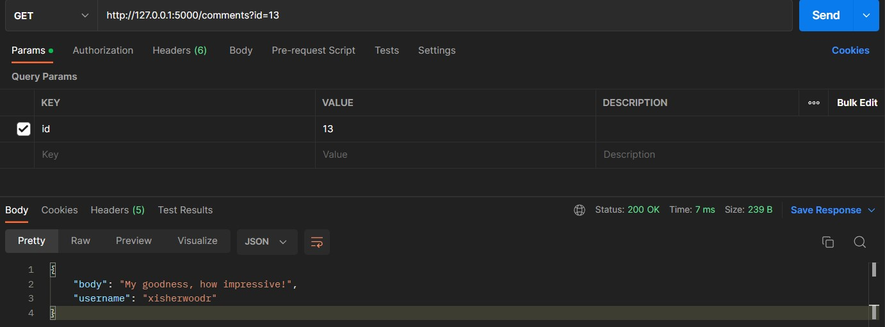
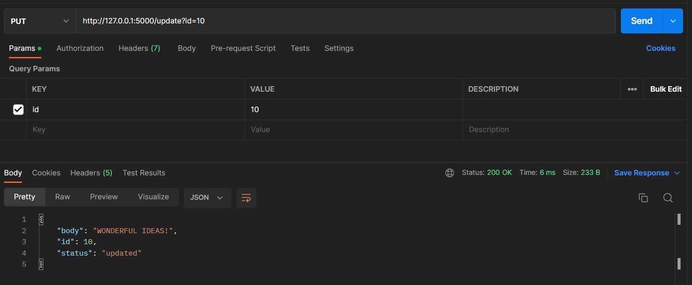
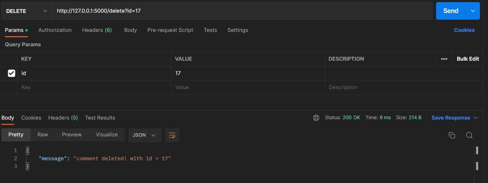

[Data source](https://dummyjson.com/comments)

---

Data is saved as comments.json in the same folder as the Readme.md file.

Create and activate a virtual environment:

`>> python -m venv env_name`

`>> env_name\Scripts\activate`

Use `pip install -r requirements.txt` to install the required packages.

Run `python assignment.py` to start the server. Then use check.ipynb or use postman to test the API.

# Postman outputs:

### 1. Create an API to return body ,username based on comments id.

### 2. Create an API to update the body of the comment into uppercase and return comment id, body and status in json format based on comment id provided.

### 3. Create an API that delete record and return response message based on comment id.

### 4. Create an API to insert new record and display response message along with data that has been inserted.

### 5. Create an API that returns count of comments along with username and status in JSON format.

### 6. Find any external API besides that given in the assignment. Retrieve the data from that api with the GET operation,clean the data and load it in your local as "example.json" file. Finally, perform all crud operations in that data.
