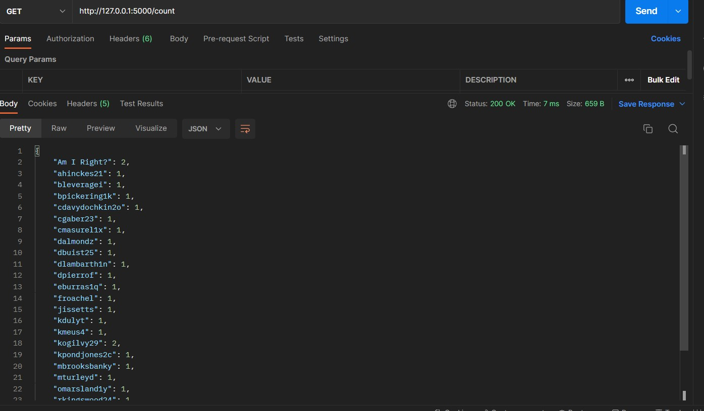

To Navigate Refer to Readme file at [Master Branch](https://github.com/amrit-fuse/python/tree/master)

This branch is child of branch [api_assignment](https://github.com/amrit-fuse/python/tree/api_assignment)  and has complete solution to assignment 

[Data source](https://dummyjson.com/comments)

Data is saved as comments.json in the same folder as the Readme.md file.

**Create and activate a virtual environment:**

`>> python -m venv env_name`

`>> env_name\Scripts\activate`

Use `pip install -r requirements.txt` to install the required packages.

# For Question 1-5 

Run `python assignment.py` to start the server.

Then use `check.ipynb` or use postman to test the API.

|**Methods**|**URL**|**Description**|
|----|----|----|
|GET|comments?id=`int`|Get body and username  of given comment id|
|PUT|/update?id=`int`| Update body to upper case|
|DELETE|/delete?id=`int`|Delete comment with given id|
|POST|/insert?id=`int`&body=`String` &post_id=`int`&user_id=`int` &username=`String`|Create a new comment with supplied comment id, body,post_id,user_id and username|
|GET| /count|Get count of comments for each username|

# Postman outputs:

### 1. Create an API to return body ,username based on comments id.

### 2. Create an API to update the body of the comment into uppercase and return comment id, body and status in json format based on comment id provided.

### 3. Create an API that delete record and return response message based on comment id.

### 4. Create an API to insert new record and display response message along with data that has been inserted.

### 5. Create an API that returns count of comments along with username and status in JSON format.

# For Question 6 

Run `python external_assignment.py` to start the server.

Then use `check.ipynb` or use postman to test the API.

|**Methods**|**URL**|**Description**|
|----|----|----|
|GET|art?id=`int`|Get title and display date for given id|
|PUT|/update?id=`int`| Update title to upper case|
|DELETE|/delete?id=`int`|Delete Art with given id|
|POST|/create?id=`int`&title=`String`&date_display=`int`|Create a new Art information with supplied  id, title and date_display|

### 6. Find any external API besides that given in the assignment. Retrieve the data from that api with the GET operation,clean the data and load it in your local as "example.json" file. Finally, perform all crud operations in that data.

Read more about the  Art institute of Chicago API here: https://api.artic.edu/docs/#quick-start 

**6.1 GET Art details**

**6.2 Update Art Title yo uppercase**

**6.3 Delete Art information**

**6.4 Insert new Art information**
